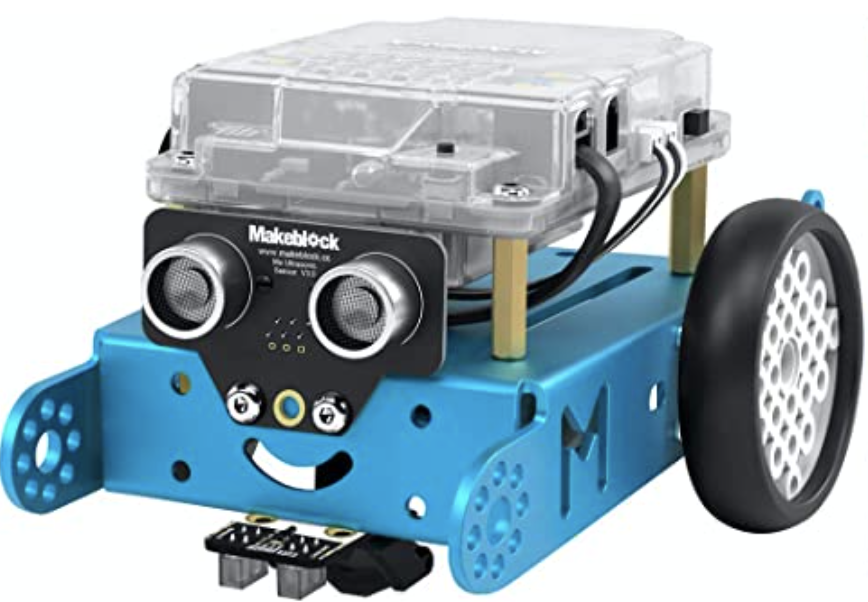
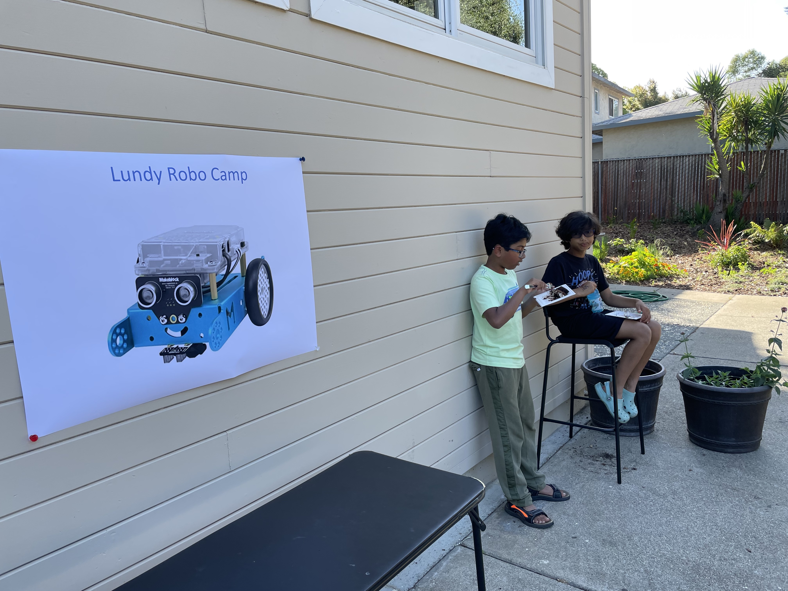

# Lundy Robo Camp

## Session Details

2023 Summer Session - 06/12 - 06/16 - [Registration](https://docs.google.com/forms/d/1SR2LRPSzKvrcT5JqMqXWO4ZTTd2dvA5ikyGO37IflTY/)

## Overview

This repository hosts the code and logistics for Lundy Robo Camp for summer of 2023

## How it works
The Robo Kit has all the materials needed, such as screws, the chassis, the computer, and wheels and motors. After following the intructions to assemble to robot, you can download the MakeBlock app to code your robot. MakeBlock follows simple drag and drop code, and the kit comes with cards giving examples of what you can create and the code that comes with it. Once you have made your program, you can test it by running it live or uploading your code onto the mBot computer.

## Where to Buy Robo Kit
[Amazon](https://www.amazon.com/Makeblock-Mechanical-Entry-Level-Programming-Creativity/dp/B00SK5RUQY)
This site has all instructions and materials needed.

## Contributors
- [Zohran](https://github.com/zamoin)
- [Hasan](https://github.com/h-baqai)

## Summer Session - 2023
2023 Summer Session - 06/12 - 06/16
- [Pictures](https://photos.app.goo.gl/BYXNAVWyunNAhnzD9)

  
&nbsp; &nbsp; &nbsp; &nbsp;
  

  
&nbsp; &nbsp; &nbsp; &nbsp;
  

- [YouTube Channel](https://youtube.com/playlist?list=PL6_LGlA3QhUJLLQfugZpc6JbzRSXwp8Hp)

